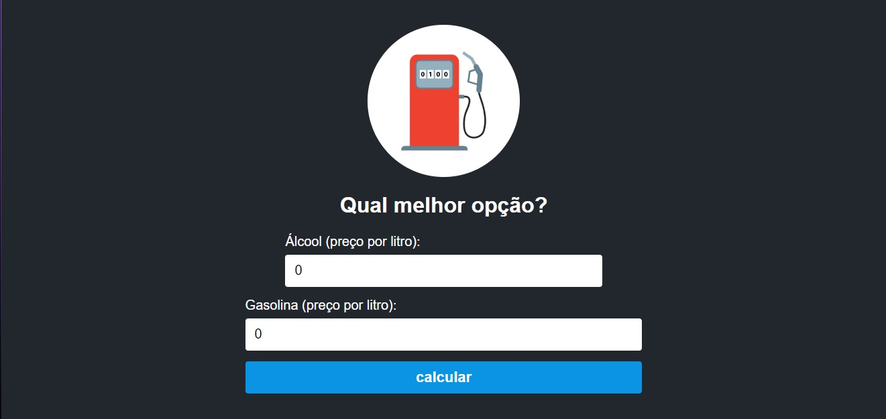

# Calculadora de Combustível

## Descrição

Este projeto é uma simples calculadora que ajuda a determinar se é mais vantajoso usar álcool ou gasolina com base nos preços fornecidos.

## Tecnologias Utilizadas

- React 
- HTML
- CSS
- TypeScript

